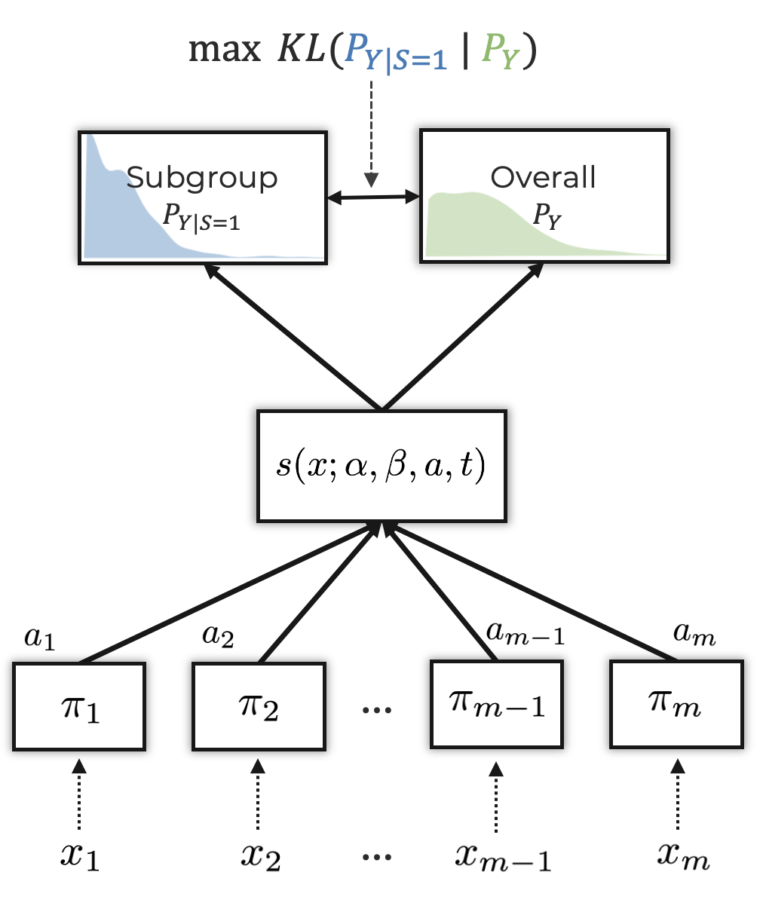
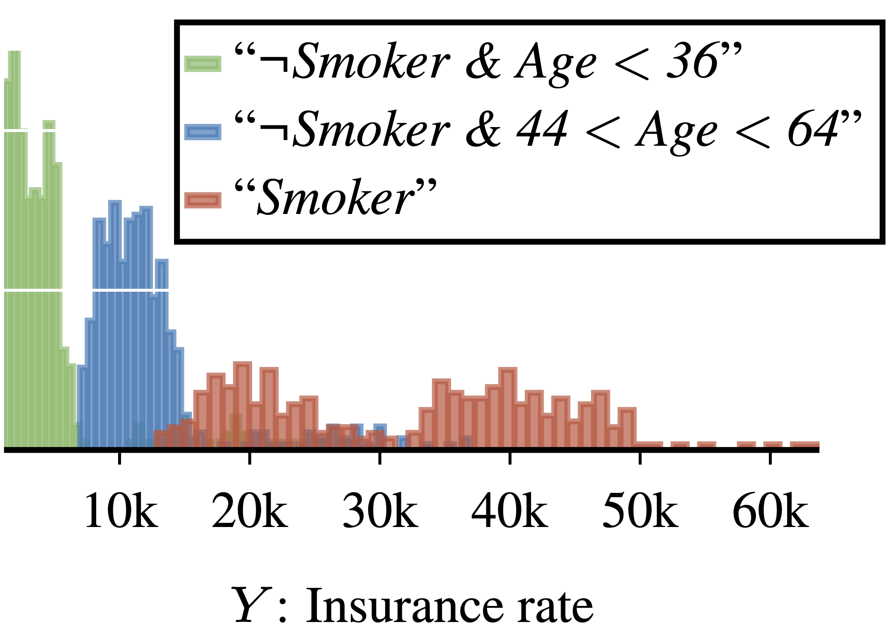

# Learning Exceptional Subgroups by End-to-End Maximizing KL-divergence

<p align=center >

</p>

This is the Python implementation belonging to the paper *Learning Exceptional Subgroups by End-to-End Maximizing KL-divergence*. The repository also includes the code required to 
replicate the results from the paper e.g. the implementation of *Robust Subgroup Discovery*.
We additionally provide a demo in a jupyter notebook to provide an easy starting point.


## 1. Required packages
- PyTorch
- Numpy
- Pandas
- Matplotlib
- flowtorch
- pysubgroup
- sklearn
- tqdm

## 2. Folder organization
- **data:** We provide the the *insurance* dataset used in the paper and the demo.
- **experiments**: Python scripts used to run all the experiments
- **scripts**: Bash scripts to run the experiments with various sets of parameters
- **src:** Contains the source code of <span style="font-variant:small-caps;">Syflow</span> and RSD, as well as further utils to replicate the results


## 3. Demo
In the jupyter notebook `demo.ipynb`, we provide a demo to show how to use 
<span style="font-variant:small-caps;">Syflow</span>. As an example, we use the *Insurance*
dataset provided in `data/` and replicate the plot below. The parameters for 
<span style="font-variant:small-caps;">Syflow</span> can be set using the `SyflowConfig` class.
To ease the readability, the majority of the code is implemented in `src/demo_utils.py`.


<p align=center >

</p>

## 4. Reproducibility
To run the experiments from the paper, either the Python scripts in `experiments`. These 
scripts can be called individually or via the bash scripts provided in `scripts`.
In both cases, the scripts generate a folder `results` with subfolders corresponding
to the specific experiment suite. For real-world data, we also output the description for
the discovered subgroups.

## 5. Citation
If you find our work useful for your research, please consider citing:


```
@inproceedings{xu2024learningicml,
  title = {Learning Exceptional Subgroups by End-to-End Maximizing KL-divergence},
  author = {Xu, Sascha and Walter, Nils Philipp and Kalofolias, Janis and Vreeken, Jilles},
  booktitle = {Proceedings of the International Conference on Machine Learning (ICML)},
  year = {2024},
  organization = {PMLR},
}
```

## 6. License
 <p xmlns:cc="http://creativecommons.org/ns#" >This work is licensed under <a href="https://creativecommons.org/licenses/by-nc-sa/4.0/?ref=chooser-v1" target="_blank" rel="license noopener noreferrer" style="display:inline-block;">CC BY-NC-SA 4.0</a></p> 


